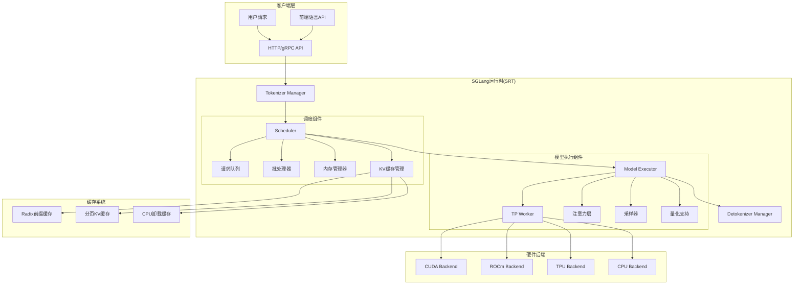
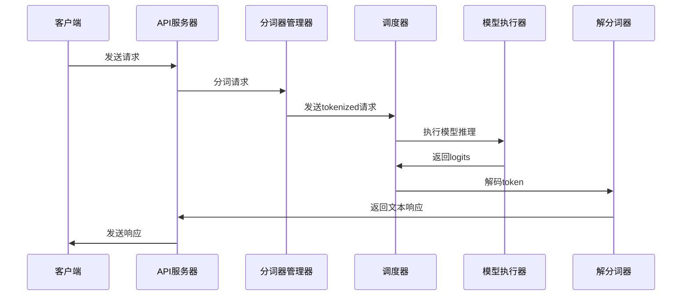
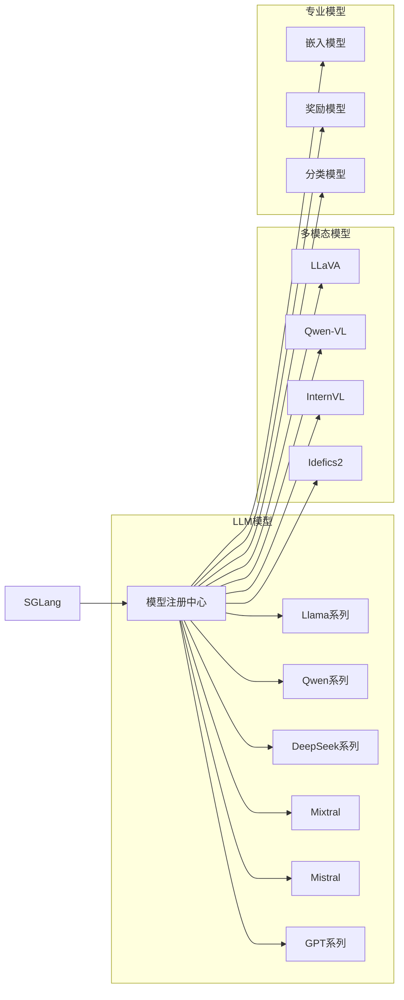

# SGLang 学习总结与架构洞察

## 项目概览

SGLang (SGLang Runtime) 是一个高性能的大型语言模型和视觉语言模型服务框架，专注于提供低延迟、高吞吐量的推理服务。该项目采用客户端-服务器架构，通过高级前端语言和优化的后端运行时，实现了高效的LLM服务部署。

## 核心设计思想

### 1. 分层架构设计
- **前端语言层 (lang/)**: 提供直观的编程接口，支持复杂LLM应用开发
- **运行时引擎层 (srt/)**: 高效的推理调度和执行引擎
- **硬件抽象层**: 屏蔽底层硬件差异，支持多种硬件平台

### 2. 模块化和可扩展性
- 通过插件化架构支持多种模型、硬件后端和优化策略
- 清晰的接口定义，便于添加新功能和优化技术
- 统一的模型注册机制，支持快速集成新模型

### 3. 性能优先的设计
- 连续批处理、前缀缓存、推测解码等先进优化技术
- 分页注意力机制，有效管理长序列内存使用
- CUDA图优化，减少Kernel启动开销

## 技术亮点

### 1. RadixAttention前缀缓存
- 使用Radix树结构缓存共享前缀的KV状态
- 显著减少重复计算，提高对话和RAG场景的效率
- 通过高效的树结构管理，支持动态插入和查找

### 2. 连续批处理
- 动态批处理不同长度和状态的请求
- 提高GPU利用率，降低延迟
- 智能内存管理，适应不同长度序列

### 3. 多层次优化策略
- 模型层面: 量化、知识蒸馏、结构化剪枝
- 系统层面: CUDA图、内存池、异步处理
- 架构层面: 张量并行、流水线并行、专家并行

### 4. 硬件广泛支持
- NVIDIA GPU: 充分利用Tensor Core和CUDA优化
- AMD GPU: ROCm支持，性能优化
- Intel平台: CPU和XPU支持
- 新兴架构: TPU和NPU支持

## 学习收获

### 1. 架构设计学习
- 了解了如何设计大规模分布式推理系统
- 学习了进程间通信和多线程编程的最佳实践
- 掌握了内存管理和资源分配的高级技巧

### 2. 性能优化技术
- 深入理解了批处理策略对性能的影响
- 学习了KV缓存管理的多种技术方案
- 了解了CUDA编程和GPU优化的实践方法

### 3. 工程化实践
- 代码模块化设计，便于维护和扩展
- 健壮的错误处理和资源管理
- 完善的测试和监控体系

### 4. 前沿技术应用
- 推测解码和草稿模型的应用
- MoE (专家混合) 模型的高效实现
- 结构化输出生成技术

## 项目优势

### 1. 高性能
- 业界领先的推理吞吐量和延迟表现
- 多种优化技术的综合应用
- 针对不同硬件平台的深度优化

### 2. 易用性
- 直观的前端语言，降低LLM应用开发门槛
- OpenAI API兼容，便于现有应用迁移
- 丰富的示例和文档

### 3. 可扩展性
- 支持从单GPU到大规模集群的部署
- 灵活的模型和硬件支持
- 模块化设计便于功能扩展

### 4. 生态系统
- 广泛的模型支持，包括主流架构
- 与Hugging Face生态的深度集成
- 活跃的社区支持和持续的开发

## 潜在优化点

### 1. 内存优化
- 更精细的内存池管理策略
- 智能的内存页面重用机制
- 更高效的缓存替换算法

### 2. 调度算法
- 更智能的请求调度策略
- 基于负载预测的动态调整
- 更好的优先级处理机制

### 3. 系统监控
- 更详细的性能指标收集
- 实时性能调优建议
- 更好的异常检测和恢复

### 4. 用户体验
- 更直观的配置管理
- 更好的错误诊断和调试工具
- 更丰富的性能分析功能

## 未来发展方向

### 1. 模型架构支持
- 更多新兴模型架构的支持
- 专门优化的模型推理路径
- 模型压缩和加速技术的集成

### 2. 硬件适配
- 对新一代GPU架构的优化
- 专用AI芯片的支持
- 云端和边缘设备的适配

### 3. 应用场景扩展
- 专门针对RAG、Agent等场景的优化
- 多模态应用的深度支持
- 垂直领域模型的定制优化

### 4. 系统智能化
- 机器学习驱动的调度和优化
- 自动性能调优
- 智能资源分配

## 架构可视化 (Mermaid格式)

### 1. 整体架构图

### 2. 请求处理流程

### 3. 模型支持矩阵

## 总体评价

SGLang是一个设计精良、工程化程度很高的LLM服务框架，展现了在高性能推理系统设计方面的深厚功底。项目代码结构清晰、文档完善、功能丰富，是学习和研究LLM服务系统的优秀范例。通过这次深入的代码分析，不仅了解了先进的推理优化技术，也学到了大型系统软件的架构设计思想和工程实践方法。

该项目在性能、易用性和可扩展性方面都达到了很高的水准，是当前LLM服务领域的重要开源项目之一，值得深入研究和应用。